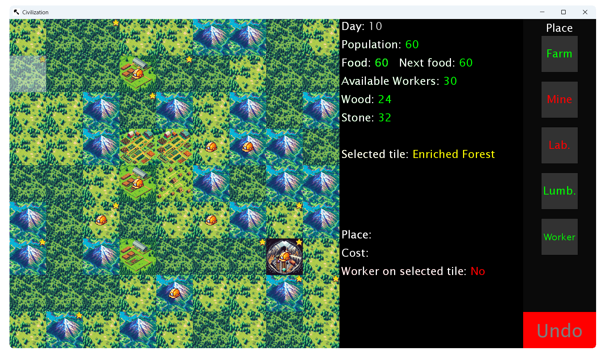

  

 By Dean Tumabcao & Alan McWilliams for a high school assignment. Coded with Java, coffee (get it?) and love. Dean overdid it.

# Version 1.0.0

## Includes  
**Latest Major**
* "Official" release
* Added version to bottom-right of title screen
* Removed workers when resetting game

**Latest Patch**
* Stopped # of workers from decreasing when trying to place worker on tile already occupied by a worker
* Added looping background music
* Fixed colors of worker on selected tile info to be accurate to selected place type
* Added worker placeable in feature to ℹ️ Stat-Sheet
* Improved README
* Changed image and code names

**Latest Minor**
* Relatively beautiful README!
* Finished worker feature
* Added undo functionality for workers
* Tidied up code
* Fixed bugs

## About
A video game where you can manage a civilization.
### 📷 Screenshots
  
### 📖 Civilization Guide
#### 👋 Introduction
Welcome to **Civilization**! In this video game, you exist in The World. You are granted godly, society-shaping powers. From ~~the~~ ~~heavens~~ wherever you are, you oversee a human village.
Whether you let them starve to death or shape them into the greatest empire since 
the Galactic Empire, what happens to them is _your_ call.
#### 🧭 How To Navigate Civilization's UI
* 🗺️ The 81 squares on the left side of the UI make up 🗺️ The World View, which consists of interactive "tiles" of The World that you can manipulate.
* 🎛️ The buttons on the right side of the UI make up the 🎛️ Place Controls, 
which consists of buttons that allow you to manipulate 🗺️ The World View to your vision.
* ℹ️ The text between those makes up the ℹ️ Stat-Sheet, which details information
about your civilization, its world, and your selected place type.
* ⚠️ If a number variable turns red, this means that it is relatively low or 0.
#### 🧩 The Fundamentals
* ➡️ You start the Game with 20 people, 500 food, 10 workers, 20 wood and 20 stone.
* 🍉 Each person needs 1 piece of food to live for a day.
* 🌓 Half of the population are workers.
* 👷 Workers are shown in 🗺️ The World View with a .
* Enriched tiles are indicated by a  on the top right of a tile.
#### ⚒️ Place Types
* 🌽 Farm
* ⛏️ Mine
* 🧪 Laboratory
* 🪵 Lumberyard
* 👐 Worker
#### ℹ️ Stat-Sheet Place Information
* 🤔 The group of text at the bottom of the ℹ️ Stat-Sheet details information about 
your selected Place type, such as what it is,  how many materials your civilization
needs to place it in The World, whether there's someone on your selected tile to work 
on it and where you can build it.
#### 🔎 How To Select Tiles
* 👆 Hover on a tile to select it. Information about that selected tile will appear 
in the ℹ️ Stat-Sheet.
#### ⏳ How To Forward Time
* ▶️ Click the "Space" key to increment a day.
* ⏩ Hold the "Space" key to increment days continuously.
#### 📌 How To Move Workers
* With no Place type selected, click on a worker (construction helmet) on 🗺️ The 
World View. Click on a surrounding tile to place them. Selecting anything else deselects them.
#### 🛠️ How To Place
* 🔨 Click on a Place button to select a Place type (eg. a farm), hover over a tile, 
and click on it to place your selected Place type there.
* 🔙 Click the Undo button to undo placements with the Undo button when the text 
lights up.
#### 🌐 Miscellaneous
* 🔚 Press the "R" key to reset Game progress & return to title screen.

#### Good luck being a god!
